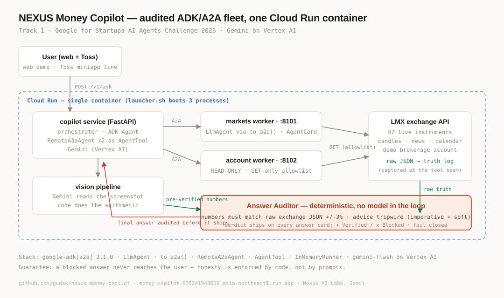

# NEXUS Money Copilot

**An audited personal-finance copilot for Korea's 50+ generation — ADK
multi-agent fleet over real A2A, grounded in a live exchange, with every answer
(text or screenshot) verified before it ships.**

> 물어보면, 검증된 답만 돌아옵니다. — Ask anything about your money; only
> verified answers come back.

**Live demo:** [money-copilot…run.app](https://money-copilot-675241948019.asia-northeast1.run.app) ·
**2½-min video:** [youtu.be/lObQ02WJzBw](https://youtu.be/lObQ02WJzBw) ·
**Track 2 sibling:** [Sentinel Mesh](https://github.com/gudax/sentinel-mesh) (the verified-memory control plane this auditor's lineage comes from)

Most finance chatbots will quote you a price from their training data and sound
confident doing it. On day 0 of this build, ours did exactly that: an A2A worker
crashed and the orchestrator **fabricated a Bitcoin price in the wrong currency
with 2024 timestamps**. That incident is now the product: every answer passes a
deterministic **Answer Auditor** — numeric claims are matched against what the
fleet's tools *actually returned this session*, and advice/money-movement
language is tripwired (EN+KR) with no model in the loop. A blocked answer never
reaches the user.

## Architecture



```
 web demo / Toss miniapp (30M-user platform, production)
        │
        ▼
 copilot service (Cloud Run, FastAPI)  ──  Answer Auditor (deterministic)
        │ orchestrator (ADK Agent, Gemini on Vertex AI)
        ├── A2A ──▶ markets  (LMX exchange live public API — 82 instruments,
        │                     candles, news+sentiment, economic calendar)
        ├── A2A ──▶ account  (brokerage account, READ-ONLY by construction)
        └── vision (screenshot → structured holdings → priced BY CODE)
```

- **Real A2A**: workers served via `to_a2a()` with live AgentCards; the
  orchestrator consumes them through `RemoteA2aAgent`.
- **Real data**: the markets agent reads the LMX exchange's public market API —
  production trading infrastructure (crypto + FX + metals + indices + US
  stocks), credential-free and read-only. The account agent reads a demo
  brokerage account through a GET-only hard allowlist; **no order, withdrawal
  or transfer surface exists in the code**.
- **Audited answers**: `fleet/auditor.py` — money-scale numbers in the final
  answer must match a value the exchange API *actually returned this request*
  (raw JSON captured at the worker tool seam via `fleet/truth_log.py`, within
  3%); buy/sell recommendations — imperative **and** soft advisory phrasing —
  and money-movement language are hard-blocked. The audit verdict ships with
  every API response and is rendered as a stamp on every answer card.
- **Every number has a receipt**: the audit doesn't just say *verified* — it
  returns, per displayed **money-scale** number, the exchange field that backs it
  (`source` + `field` + matched value, via `auditor.build_receipts` +
  `truth_log.read_since_tagged`). Field selection is semantic: a current price
  cites `price`/`close`, never a candle's `low` that happens to share the digits.
  The web UI underlines every audited number; tap one to see the field that proves
  it. Verification stops being a badge you have to trust and becomes **evidence
  you can open** — the same drill-to-the-source idea as our Track 2 entry,
  Sentinel Mesh. (Counts, sub-$10 deltas, and chart-axis labels are out of scope
  by design — the gate is for money-scale figures.)
- **Vision, but never model arithmetic**: upload any brokerage screenshot and
  `fleet/vision_tools.py` splits the work — Gemini vision is trusted only to
  *read* (structured extraction, no invented numbers), then plain Python prices
  the holdings against live LMX quotes. Both outputs join the session's tool
  outputs, so the auditor holds the final narration to exactly those numbers.

## Quickstart

```bash
python3 -m venv .venv && source .venv/bin/activate
pip install -r requirements.txt   # pinned: ADK 2.1.0 + google-genai 1.75.0

# fleet (A2A workers + orchestrator checkpoint)
export GOOGLE_GENAI_USE_VERTEXAI=1 GOOGLE_CLOUD_PROJECT=<proj> GOOGLE_CLOUD_LOCATION=global
export LMX_DEMO_EMAIL=<demo-account> LMX_DEMO_PASSWORD=<demo-password>
python fleet/serve_worker.py markets 8101 &
python fleet/serve_worker.py account 8102 &
curl localhost:8101/.well-known/agent-card.json     # live AgentCard
python fleet/orchestrator.py "비트코인 지금 얼마야? 차트로 보여줘."

# the auditor's own checkpoint (the day-0 incident must be caught)
python fleet/auditor.py

# audited service + web demo
uvicorn service.app:app --port 8110                  # then open http://localhost:8110
```

## Honest engineering notes

- **ADK 2.2.0 + current google-genai breaks A2A-over-Vertex** (`part_metadata
  parameter is only supported in Gemini Developer API mode`). The worker crashes
  — and an unguarded orchestrator then *fabricates* answers. Pinned to
  `google-adk[a2a]==2.1.0` + `google-genai==1.75.0`; the auditor exists so this
  failure class can never ship regardless.
- The LMX candles API returns **newest-first string numbers**; the tool layer
  normalizes to chronological floats before any model sees them.
- The demo account is a real account on a live exchange — which is exactly
  why both tool modules are GET-only hard allowlists, asserted at call time.
- **The audit's truth set is the raw exchange JSON, not model prose**: every
  worker tool seam logs its raw HTTP response (`fleet/truth_log.py`), and the
  auditor matches the final answer against those numbers — a worker
  hallucination can't vouch for itself, because the model never sits between
  the API and the audit.
- Verification lineage: the auditor's tripwire and fail-closed philosophy are
  vendored from [Sentinel Mesh](https://github.com/gudax/sentinel-mesh), our
  verified-memory control plane (separate submission, Track 2).

## License

MIT
